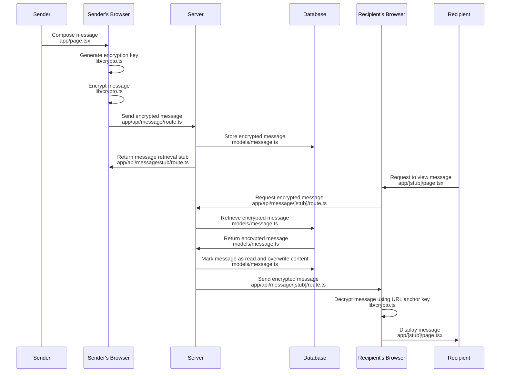

## Secure Share web-app

*Important Note: This project is part of an in-person tutorial series and serves as a reference implementation for educational purposes. The goal is to demonstrate how to build a simple product with real-world utility beyond academic exercises. It is not intended for production use.*

SecureShare is a tutorial and reference implementation of a one-time-use message sharing web-app, developed using Next.JS 14, TypeScript, Prisma, and styled with Tailwind CSS

### Core functionality

- Messages are encrypted directly on the sender’s device before being transmitted, and the server stores only the encrypted data, without ever accessing the encryption key.
- Once the message is stored, a unique URL is generated that includes the encryption key as an anchor, ensuring that the server remains unaware of the key.
- Recipients can use this URL to securely decrypt and view the message.
- The message is automatically marked as read and the content is overwritten, ensuring that it can only be viewed once.

See [Sequence diagram](#sequence-diagram) below for a detailed overview of the process


#### Technology Stack:

    Framework: Next.js 14
     Language: TypeScript
          ORM: Prisma (for PostgreSQL)
      Styling: Tailwind CSS

### System requirements

- Node.js (16.x or later) or Bun (1.1 or later)
- PostgreSQL (13.x or later)

### Recommended tools

- Visual Studio Code
- Postman
- Chrome

### Setup

1. Clone the repository:

```bash
git clone git@github.com:johanns/ref-secure-share.git
```

2. Install dependencies:

```bash
npm install
```
or
```bash
bun install
```

3. Create a `.env` file in the project root and add the following environment variables:

```bash
DATABASE_URL="postgresql://<username>:<password>@localhost:5432/<database>"
```

NOTE: Replace `<username>`, `<password>`, and `<database>` with your PostgreSQL credentials.

4. Run the Prisma migration:

```bash
npx prisma migrate dev
```
or
```bash
bun run prisma migrate dev
```

5. Run the development server:

```bash
npm run dev
```
or
```bash
bun run dev
```

5. Open your browser and navigate to `http://localhost:3000`.

### Project directory structure and core files

```
prisma
├── migrations/ -- Database migration files
└── schema.prisma -- Prisma schema definition

src
├── app
│   ├── api
│   │   └── message
│   │       ├── route.ts -- Message creation endpoint (POST)
│   │       └── [stub]
│   │           └── route.ts -- Message retrieval endpoint (GET, DELETE)
│   ├── layout.tsx -- Application layout
│   ├── page.tsx -- Message creation page
│   └── [stub]
│       └── page.tsx -- Message retrieval page
├── assets
│   └── css
│       └── globals.css
├── lib
│   ├── crypto.ts - Client-side encryption/decryption functions
│   ├── modelValidationError.ts - Model validation error handler
│   └── prisma.ts - Prisma client initialization
└── models
    └── message.ts - Message model
```

### Sequence diagram



